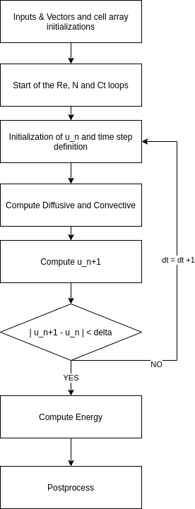
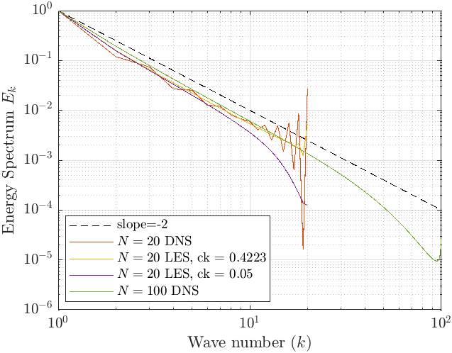
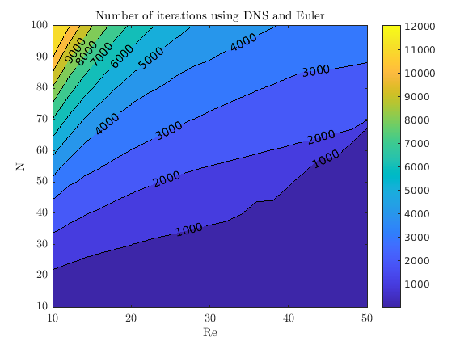

# Burgers1D_Solver

This codes develops a turbulent flow analyais using the burgers theory which simplifies the turblence model and the Navier-Stokes equations.

The code has been developed for a 1D model and validates using the professor's results.

## Code report 
---

This report is developed with the purpose of giving the student a better understanding of what is turbulence modelling and its analysis. A brief introduction about the Burger's equation and the theories behind the models used later on the report. The study consist in the analysis of the Burger's equation in the Fourier space analysing the behaviour of the total energy as a function of the Reynolds Number [Re], the number of modes [N] and finally the effect of these two on the number of iterations of the model. Finally a comparison between LES [Large Eddy Simulation] and DNS [Direct Numerical Simulation] is made in order to analysis when the  increase in computational cost is necessary.

---

The report can be found here in the following link:

<a href="/Burgers_equation.pdf" download>Download report</a>

The code structure is described in the following image:

Some of the results you should get when runing the code are:

 

Please contact me to the following email if you find any mistake ar have any questions regarding the development:

<edgargc.upc@gmail.com>
